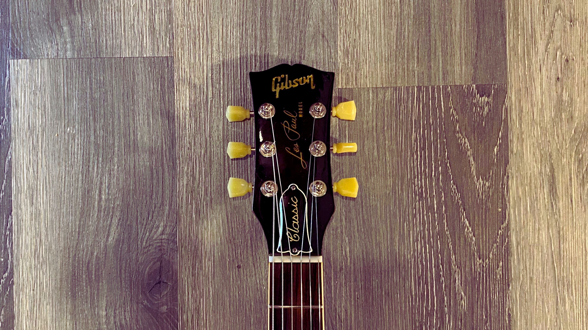

# The Paul Classic 1960's

<figure markdown="span">
    { loading=lazy }
    <figcaption>
    Butterfly, a Les Paul Classic 1989, the very first year of the model.
</figcaption>
</figure>
It started in 1989, with the release of the Les Paul Classic, a guitar that was designed to be a modern version of the Les Paul Standard from the 1960's.

<!-- more -->

https://www.facebook.com/groups/256514716122075/posts/927829122323961?comment_id=927951275645079&reply_comment_id=928027935637413

https://www.facebook.com/groups/256514716122075/posts/928246598948880/?comment_id=928580612248812

## Inventory of the Les Paul Classic 1960's

The Les Paul Classic 1960's has been produced in different models, and each one has its own unique features.

??? info "Inventory of the Les Paul Classic 1960's (click to expand)"
    {{ read_yaml('./yml/generated_guitars_classic_1960.yml')  }}
