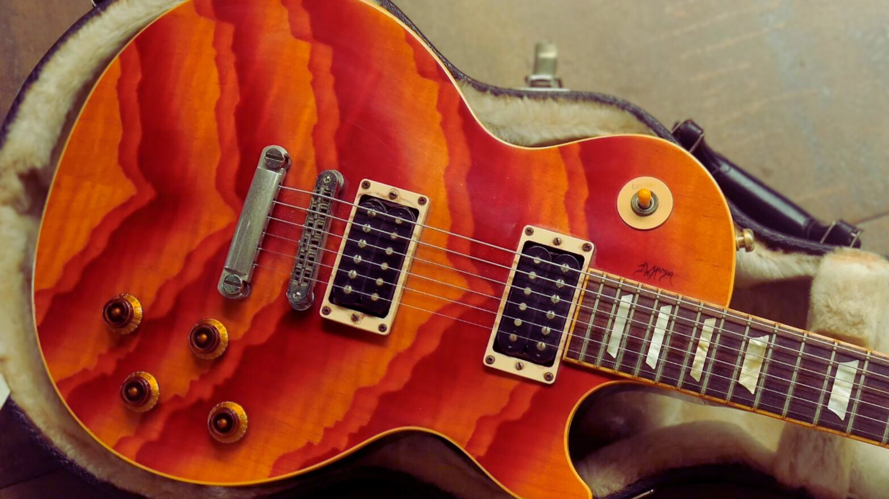

# All The Guitars Of The Week (GOTW)

{ loading=lazy }
In 2007, **Gibson** did a series of limited editions called the Guitar Of The Week, also known as GOTW.
A new limited run of 400 Guitars was presented every week on Tuesdays.
The runs started on January 22nd with an SG Supreme Bass and finished on December 18th with a reissue of an RD Standard.

<!-- more -->

These limited editions brought a lot of different models on the market,
with varying sets of features that were not common at this time.
In some cases, like the Week 33, the old Gibson logo on the headstock can confuse and make you think the Guitar is
fake. _Reference: [The "FANCY" Logo, 2007 Gibson Guitar of the Week 33 GOTW 33 Les Paul Classic Antique Review + Demo](https://www.youtube.com/watch?v=s-38AOmakes)_

???+ info The 47 unique series
    _This website is dedicated to inventorying the different Les Paul Classic models.
    We will only detail the Les Paul Classic models and provide a list of all the other models that were part of the GOTW series._

    * 22 Les Paul
    * 13 SG
    * 5 Explorer
    * 3 Flying V
    * 3 Firebird
    * 1 RD

    _reference: [See all of the Guitars of the Week](https://web.archive.org/web/20090525125505/http://www.gibson.com/en%2Dus/Divisions/Gibson%20USA/Guitar%20of%20the%20Week)_

## Inventory of the Guitars Of The Week

???+ info "Inventory of the Guitar Of The Week"

    {{ read_yaml('./yml/inventory-guitars-of-the-week.yaml')  }}

!!! note "Week 45 was skipped"
    It is often mentioned that #45 was pulled and turned into the Joan Jett signature model Melody Maker, but Gibson has not
    confirmed this.

    _reference: [Gibson Guitar of the Week series](https://www.everythingsg.com/threads/gibson-Guitar-of-the-week-series.37026/post-540676)_

## External links

* [That Time Gibson Did 47 Limited Edition Guitars In a Year](https://www.youtube.com/watch?v=tLwrtCSQiNg)
* [Gibson USA 2007 Guitar of the Week](http://www.musicasa.es/namm-messe.com/gibson_Guitar_of_the_week.htm)
* [2007 Guitars of the Week (Quality?, Value?)](https://www.mylespaul.com/threads/2007-Guitars-of-the-week-quality-value.6717/)
