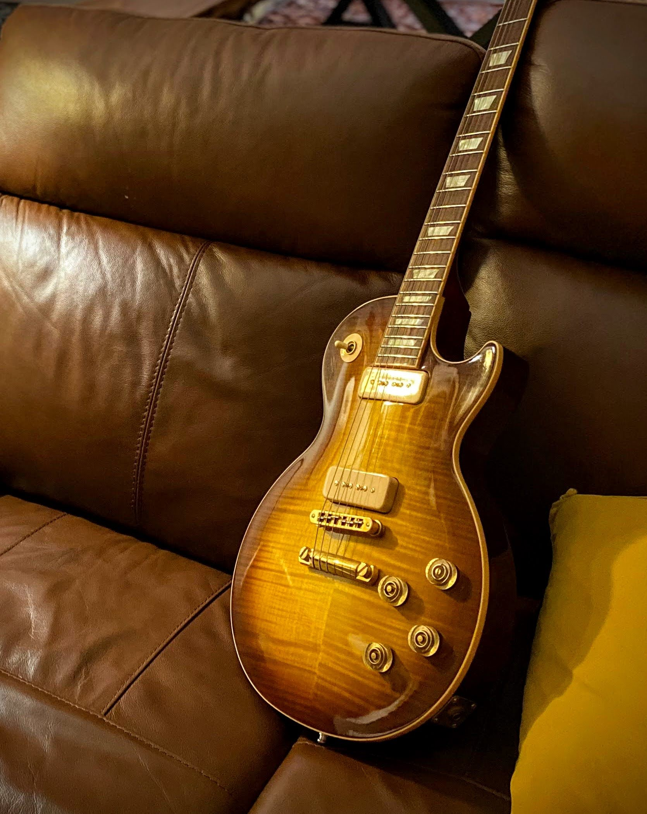

# Les Paul Classic Antique Guitar Of The Week #14

<figure markdown="span" >
  { loading=lazy }
  <figcaption>
    The week 14 and its unique pickups.
</figcaption>
</figure>

<!-- more -->

## History
The Gibson Les Paul Classic Antique Guitar Of The Week #14,
a part of the unique [Guitar Of The Week](./2007-guitar-of-the-week.md) event, is a rare find.
This one-shot event, organized by Gibson in 2007, introduced a new and unique model every week, alongside their regular production.
Today, it stands as a unique piece in the [Mod collection](https://www.gibson.com/en-US/Collection/gibson-mod).
On April 24th, in the 14th week, this [Classic Antique](./2007-les-paul-classic-antique.md) was added to the list, the fourth Antique, following the regular, week#02, week#05.
Three more models joined the family in weeks #19, #27, and #33, all in the same year, making it a limited and exclusive addition to any collection.

The Gibson Les Paul Classic Antique Guitar Of The Week #14 stands out among the several Les Paul Classics in Gibson's regular production.
It inherits the iconic Les Paul Classic 1960s' and the [Les Paul Classic Custom](./2007-les-paul-classic-custom.md), making it a unique and exciting addition to any collection.

## Specifications

### Slim taper Neck
The Les Paul Classics are well known for their neck—a modern profile loved by some and hated by others.
The slim-taper neck is a reproduction of the 1960 Les Paul.
It is the slimmer neck from Gibson's production.
The first fret is around 0.8 to 0.9, and the 12th fret is close to 1.00 but never more.
The neck is decorated with vintage bindings and trapezoid inlays.

### Headstock
The antiques share the same kind of headstock.
Unlike regular Classics, the head is enlightened with vintage bindings, continuing the neck decoration.
In the middle of the headstock, the `Les Paul` silk screen is replaced by the holy crown, which you would find on SG or ES models.

<figure markdown="span">
    { loading=lazy width=600 }
    <figcaption>
    Headstock, with the Holy Crown
</figcaption>
</figure>

### Unique pickups

{ loading=lazy width=350 align=right}

The Week#14 followed the regular Les Paul Classic Antique with the aged binding and the crown headstock.
This model came with a unique AA flamed maple ice tea burst.
Another key difference with regular production is the pickups.
At first sight, they can be seen as P-90, which would be already something noticeable for a Les Paul Classic.
In 2007, only the Les Paul Double Cut from 2003 was equipped with the P-90.
While it would make this model separate, what appears as P-90s are H-90 pickups: "Humbuckers"-90.
Gibson's H-90 stacked double coil pickup results from a close collaboration with Billie Joe Armstrong.
It offers the snarl and punch of a classic, vintage P-90 with no 60-cycle hum that usually plagues traditional single-coil pickups.
H-90 pickups are stacked magnets on top of each other, while regular humbuckers are side-by-side magnets.

Additionally, the H-90 offers a split to mimic the sound of regular P-90s.
The two-tone controls are push/pull.
Only this model, week#14, was equipped with these H-90s, and no other Gibson model has had them since.

### Hardware
The regular antique nickel hardware is replaced here by golden hardware.
The tune-o-matic, the stop bar and the strap buttons are upgraded, giving a luxury aspect to the guitar.
The knobs are amber speed knobs.

## Gallery

## References

* [Archives of Gibson's Guitar Of The Week #14 web page](https://web.archive.org/web/20090527185156/http://www.gibson.com/en%2Dus/Divisions/Gibson%20USA/Guitar%20of%20the%20Week/Les%20Paul%20Classic%20Antique%2014/)
* [Gibson Guitar Of The Week #14 Les Paul Classic Antique Iced Tea Burst 2007 on Reverb](https://reverb.com/p/gibson-guitar-of-the-week-number-14-les-paul-classic-antique-iced-tea-burst-2007)
