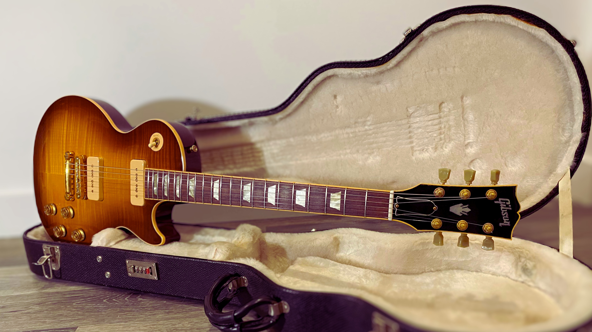

# Les Paul Classic Antique Guitar Of The Week #14

<figure markdown="span" >
  { loading=lazy }
  <figcaption>
    The week 14 and its unique pickups.
</figcaption>
</figure>

<!-- more -->

## History
The Gibson Les Paul Classic Antique Guitar Of The Week #14,
a part of the unique [Guitar Of The Week](./2007-guitar-of-the-week.md) event, is rare, with only 400 produced.
This one-shot event, organized by Gibson in 2007, introduced a new and unique model every week alongside their regular production.
We can compare the Guitar Of The Week to the current [Mod Collection](https://www.gibson.com/en-US/Collection/gibson-mod).
On April 24th, in the 14th week, this [Classic Antique](./2007-les-paul-classic-antique.md) was added to the list, the fourth Antique, following the regular, week#02, week#05.
Three more models joined the family in weeks #19, #27, and #33, all in the same year, making it a limited and exclusive addition to any collection.

The Gibson Les Paul Classic Antique Guitar Of The Week #14 stands out among the several Les Paul Classics in Gibson's regular production.
It inherits the iconic Les Paul Classic 1960s' and the Les [Les Paul Classic Custom](./2007-les-paul-classic-custom.md), but what truly sets it apart is its unique and exciting features, making it a must-have addition to any collection.

## Specifications

### Flamed Maple Top
The antiques are tributes to the iconic Les Paul Standard produced before it.
This model has a flamed maple top and is wearing an iced tea burst.
The colour of an Ice Tea Burst Les Paul guitar can be described as a warm, sun-kissed gradient that combines shades of amber, honey, and deep tea brown.
The center of the guitar typically showcases a lighter, golden amber hue, which gradually transitions into darker brown tones towards the edges, resembling the colour of iced tea.
The top can vary from a calm, subtle dancing top to a stripped, apparent flame one.
The back is the same colour as the edge of the top.

The model is not advertised as weight-relieved, but it is expected to be under 8 lbs, which is low for a Les Paul.
It is associated with high-quality wood that was used at this time.
The lightweight keeps a great sound and sustain, as expected from a Les Paul.

### Royal Headstock
The antiques share the same kind of headstock.
Unlike regular Classics, the head is enlightened with vintage bindings, continuing the neck decoration.
In the middle of the headstock, the `Les Paul` silk screen is replaced by the holy crown, which you would find on SG or ES models.

<figure markdown="span">
    { loading=lazy width=600 }
    <figcaption>
    Headstock, with the Holy Crown
</figcaption>
</figure>

### Slim taper Neck
The Les Paul Classics are well known for their neck—a modern profile replicating the [1960 Les Paul "Burst"](https://www.youtube.com/watch?v=o3NuN9-T184&ab_channel=fivewattworld).
It is the slimmer neck from Gibson's production.
The first fret is commonly around 0.8 to 0.9 inches, and the 12th fret is close to 1.00 inches but rarely more.
The rosewood fingerboard is decorated with vintage bindings and pearloid trapezoid inlays.

### Unique pickups

{ loading=lazy width=350 align=right}

The Week#14 model had a unique AA flamed maple ice tea burst.
One of the key differences from the regular production is the pickups.
At first sight, they can be seen as P-90, which would be already something noticeable for a Les Paul Classic.
However, what appears as P-90s are H-90 pickups: 'Humbuckers'-90.
These are not traditional P-90s but a particular type of pickup developed by Gibson in collaboration with Billie Joe Armstrong.
The H-90 offers the snarl and punch of a classic, vintage P-90 with no 60-cycle hum that usually plagues traditional single-coil pickups.
H-90 pickups are stacked magnets on top of each other, while regular humbuckers are side-by-side magnets.

Additionally, the H-90 offers a split to mimic the sound of regular P-90s.
The two-tone controls are push/pull.
Only this model, week#14, was equipped with these H-90s; this is the first Gibson model to have them since.

### Luxury Hardware

The regular antique nickel hardware is replaced here by luxurious golden hardware.
The tune-o-matic, the stop bar and the strap buttons are upgraded, giving a regal aspect to the guitar.
The knobs are ambered speed knobs. Green key pearloid in the gold finish is again a tribute to the Les Paul Standards.

All these upgrades, combined with the iced tea flame top, give the guitar an elegant and impressive appearance.

### Summary

!!! abstract "Specifications"

    === "BODY"
        * **Top Species**: AA Figured Maple
        * **Back Species**: Mahogany
        * **Binding**: Antique Top Binding
        * **Body Finish**: Gloss Nitrocellulose Lacquer
        * **Finishes**: Ice Tea Burst

    === "NECK"
        * **Species**: Mahogany
        * **Profile**: 1960s Slim Taper
        * **Head Inlay**: Antique Binding, Holly Crown
        * **Head Binding**: Single bound

    === "FINGERBOARD"
        *  **Species**: Rosewood
        *  **Binding**: Antique
        *  **Inlays**: Pearloid Trapezoid

    === "HARDWARE"
        *  **Plating Finish**: Gold
        *  **Tailpiece**: Stopbar
        *  **Bridge**: Tune-O-Matic
        *  **Knobs**: Amber Speed Knob
        *  **Tuners**: Green Key

    === "ELECTRONICS"
        * **Neck Pickup**: H-90
        * **Bridge Pickup**: H-90
        * **Controls**: 2 volume, 2 tone, 3-way switch - with push/pull pots

    _reference: [Gibson.com](https://web.archive.org/web/20090527185156/http://www.gibson.com/en%2Dus/Divisions/Gibson%20USA/Guitar%20of%20the%20Week/Les%20Paul%20Classic%20Antique%2014/)_

## Gallery

- <a href="https://reverb.com/item/80769230-gibson-les-paul-classic-antique-guitar-of-the-week-14?show_sold=true" target=_blank>#009370312 ^:material-open-in-new:^</a>

    ---
    <figure markdown="span">
      { loading=lazy}
    </figure>

- <a href="https://kcvintageguitars.com/products/2007-gibson-lp-classic-antique-gotw-14" target=_blank>#009370317 ^:material-open-in-new:^

    ---
    <figure markdown="span">
      { loading=lazy}
    </figure>

- <a href="https://guitarchimp.com/products/2007-gibson-les-paul-classic-antique-h90-guitar-of-the-week-14-iced-tea-burst" target=_blank>#009370336 ^:material-open-in-new:^

    ---
    <figure markdown="span">
      { loading=lazy}
    </figure>

- <a href="https://reverb.com/item/83491760-gibson-guitar-of-the-week-14-les-paul-classic-antique-2007-iced-tea-burst" target=_blank>#009370350 ^:material-open-in-new:^

    ---
    <figure markdown="span">
      { loading=lazy}
    </figure>

- <a href="https://theloftatlays.com/product/2007-gibson-les-paul-iced-tea/" target=_blank>#009370363 ^:material-open-in-new:^

    ---
    <figure markdown="span">
      { loading=lazy}
    </figure>

[//]: # (too slow to load, and the pictures are low quality)
[//]: # (- <a href="https://www.worthpoint.com/worthopedia/gibson-les-paul-classic-antique-burst-473388272" target=_blank>#009370389 ^:material-open-in-new:^)

[//]: # ()
[//]: # (    ---)

[//]: # (    <figure markdown="span">)

[//]: # (      ![#009370389]&#40;https://thumbs.worthpoint.com/zoom/images1/360/0913/30/gibson-les-paul-classic-antique-burst_360_ffcc429ccb6b481ab8cad82890cce36b.jpg&#41;{ loading=lazy})

[//]: # (    </figure>)

- <a href="https://www.californiamusic.fr/electric-guitars/solid-body/gibson-les-paul-classic-antique-burst-2007,produit_3915_en.html" target=_blank>#009470419 ^:material-open-in-new:^

    ---
    <figure markdown="span">
      { loading=lazy}
    </figure>

[//]: # (These serial numbers are odd, dated to 2008, but they match the specs of a GOTW14)
- <a href="https://www.ebay.com/itm/113841685626" target=_blank>#003180359 ^:material-open-in-new:^

    ---
    <figure markdown="span">
      { loading=lazy}
    </figure>

- <a href="https://justmusic.net.au/product/2008-gibson-les-paul-classic-antique/" target=_blank>#009580428 ^:material-open-in-new:^

    ---
    <figure markdown="span">
      { loading=lazy}
    </figure>

- <a href="https://www.ebay.com/itm/276479916940" target=_blank>#009580435 ^:material-open-in-new:^

    ---
    <figure markdown="span">
      { loading=lazy}
    </figure>

## External links and references

* [Archives of Gibson's Guitar Of The Week #14 web page](https://web.archive.org/web/20090527185156/http://www.gibson.com/en%2Dus/Divisions/Gibson%20USA/Guitar%20of%20the%20Week/Les%20Paul%20Classic%20Antique%2014/)
* [Gibson Guitar Of The Week #14 Les Paul Classic Antique Iced Tea Burst 2007 on Reverb](https://reverb.com/p/gibson-guitar-of-the-week-number-14-les-paul-classic-antique-iced-tea-burst-2007)
* [Soundcheck: 2007 Gibson Les Paul "Classic Antique" Soapbar Part 1 (clean)](https://www.youtube.com/watch?app=desktop&v=ifr8JUIDWDg&ab_channel=GregsGuitars)
