# The Classic Antique Family

<figure markdown="span">
    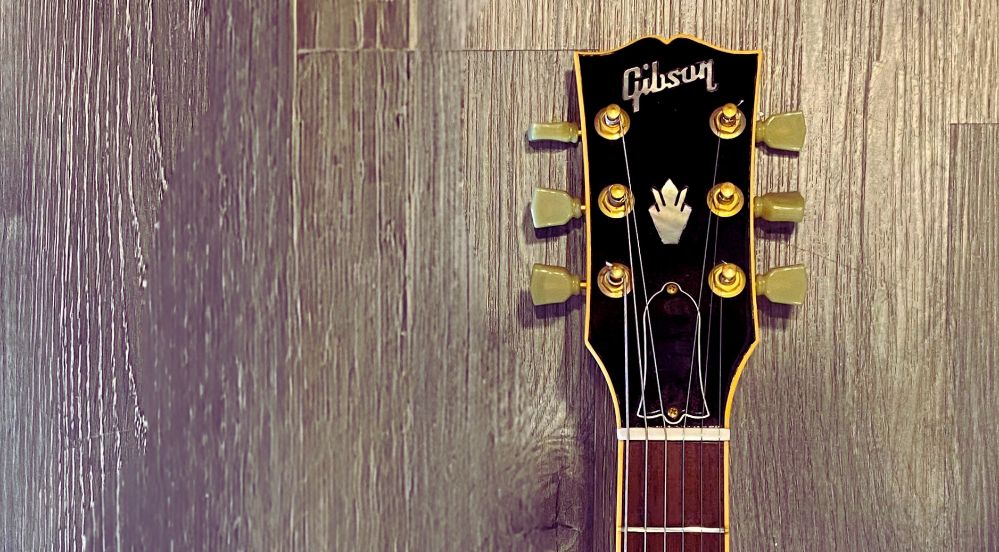{ loading=lazy }
    <figcaption>
    Headstock of a Les Paul Classic Custom, first edition
</figcaption>
</figure>

In 2007, **Gibson**, along the [Les Paul Classic Custom](./2007-les-paul-classic-custom.md) did a short run of Les Paul
Classic Antique models.
The Les Paul Classic Antique has a crown on the headstock
and an aged binding on the body and neck.
<!-- more -->

The regular edition of Les Paul Classic Antique was produced between 2007 and 2008.
In 2007, the Les Paul Classic Antique was also part of
the [Guitar Of The Week](blog/category/guitar-of-the-week---gotw/) series.

All the Antique come initially with a Hardshell With a Black Reptile Pattern with a white interior.

## A royal headstock

Typically, the headstock of a Gibson USA Les Paul Classic has a silk screen with "Les Paul Model" written on it.
The Gibson Custom Shop has a split diamond inlay.
The Classic Antique wears a crown that replaces the silk screen.
This crown is not a unique feature. It can also be found on the SG or ES models.

<figure markdown="span">
    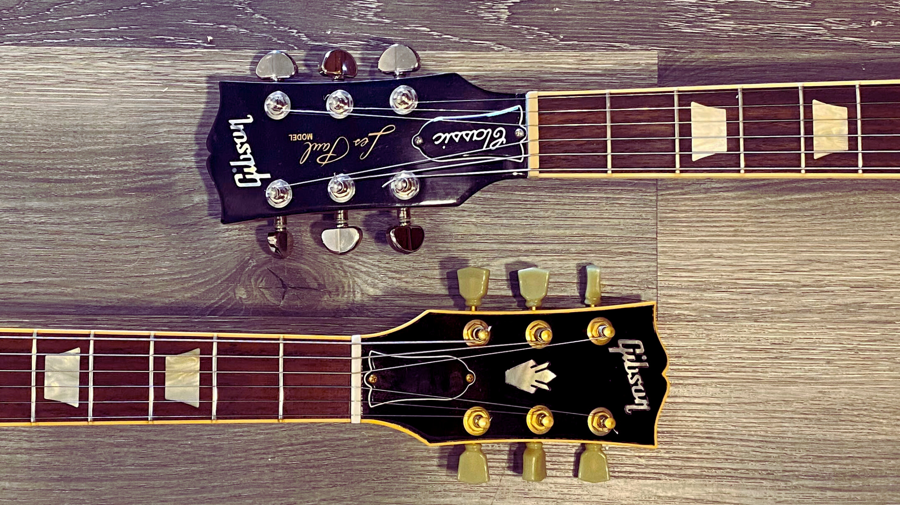{ loading=lazy width="500" }
  <figcaption>
    On the top is a typical headstock of a Les Paul Classic.
     
    On the bottom is the crowned headstock of a Les Paul Classic Antique.
  </figcaption>
</figure>

## Aged bindings

The antique refers to an aged guitar that comes from the past.
The binding on the body and the neck has a yellow tint to mimic what happens to the binding over time.
The light has tinted the lacquer on vintage guitars over the years.
The lacquer turns yellow.
It is more evident in the biding as it is white or cream. However,  the entire guitar is affected by aging. On the Antique, the aging effect is only applied to the binding.

<figure markdown="span">
  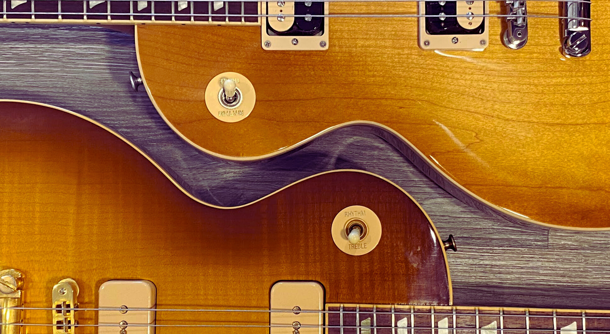{ loading=lazy width="500" }
  <figcaption>
    On the left is a natural binding on a current Les Paul Classic.
     
    On the right, aged binding on antique on a GOTW#14.
</figcaption>
</figure>

## Inventory of the Les Paul Classic Antique

The Les Paul Classic Antique was produced in 2007 and 2008.
It only exists in one regular edition and six limited editions, part of the [Guitar of the Week](2007-guitar-of-the-week.md) series.

??? info "Inventory of the Les Paul Classic Antique (click to expand)"
    {{ read_yaml('./yml/generated_guitars_classic_antique.yml')  }}

## Details on the different models

### The Regular Edition

[//]: # (![Les Paul Classic Antique Honeyburst2]&#40;img/2007-les-paul-classic-antique-honey-burst2.jpeg&#41;{ width="140" align=right})

The regular edition of the Les Paul Classic Antique is a vintage-inspired guitar.
It comes with an AA maple top, a mahogany body, and a mahogany neck with a gloss finish.
It is loaded with two '57 Classic humbuckers.

It comes in three different finishes: [Honey burst](img/2007-les-paul-classic-antique-honey-burst2.jpeg),
[Heritage Cherry Sunburst](img/2007-les-paul-classic-antique-vintage-cherry-sunburst.webp)
, and [Vintage Sunburst](img/2007-les-paul-classic-antique-vintage-sunburst.jpeg).
[//]: # (  ![Image title]&#40;https://dummyimage.com/600x400/&#41;)

<figure markdown="span">
  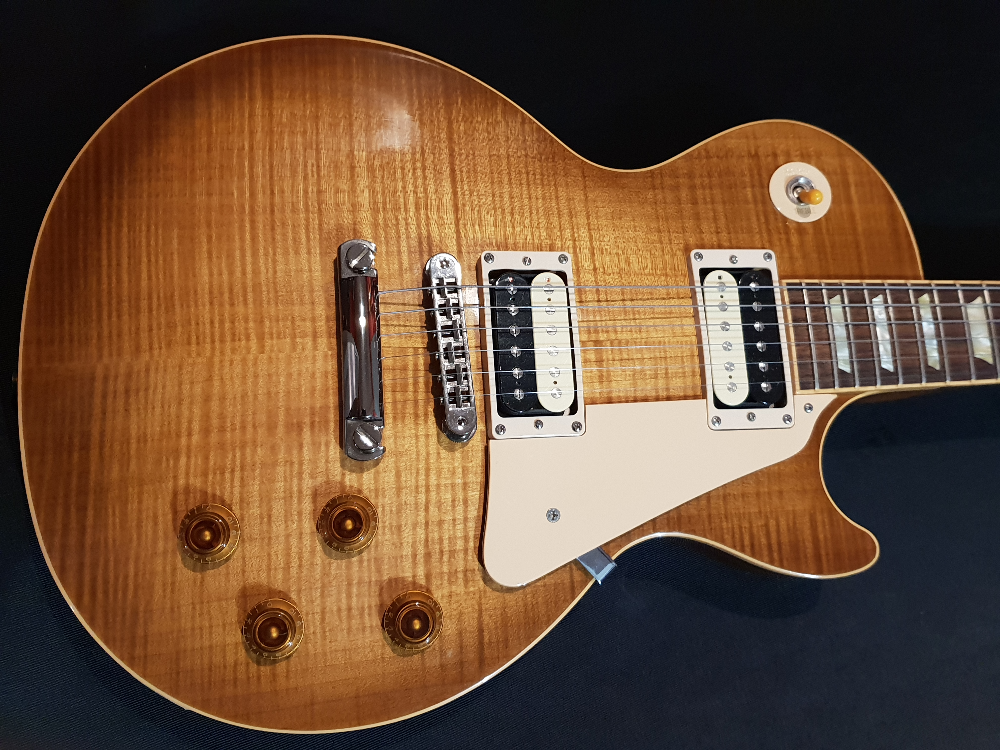{ loading=lazy width="600"}
  <figcaption>
    A Les Paul Classic Antique in Honey Burst.
</figcaption>
</figure>

??? example "Specifications (click to expand)"

    === "BODY"
        * **Top Species**: AA Figured Maple
        * **Back Species**: Mahogany
        * **Binding**: Antique Top Binding
        * **Body Finish**: Gloss Nitrocellulose Lacquer
        * **Finishes**: Honey burst, Heritage Cherry Sunburst, Vintage Sunburst

    === "NECK"
        * **Species**: Mahogany
        * **Profile**: 1960s Slim Taper
        * **Head Inlay**: Antique Binding, Holly Crown
        * **Head Binding**: Single bound

    === "FINGERBOARD"
        *  **Species**: Rosewood
        *  **Binding**: Antique
        *  **Inlays**: Pearloid Trapezoid

    === "HARDWARE"
        *  **Plating Finish**: Nickel
        *  **Tailpiece**: Stopbar
        *  **Bridge**: Tune-O-Matic
        *  **Knobs**: Amber Top Hat
        *  **Tuners**: Green Key

    === "ELECTRONICS"
        * **Neck Pickup**: '57 Classic Plus, Uncovered With Nickel Polepieces
        * **Bridge Pickup**: '57 Classic Plus, Uncovered With Nickel Polepieces
        * **Controls**: 2 Volume, 2 Tone, 3-Way Switch

    _reference: [Gibson.com](https://web.archive.org/web/20080724043054/http://www.gibson.com/en-us/Divisions/Gibson%20USA/Guitars/LesPaul/Classics/Les%20Paul%20Classic%20Antique/)_

---
### Guitar Of The Week 02 - Les Paul Classic Antique - fireburst

The Week 2 - Les Paul Classic Antique, released on January 29th, 2007, is a Les Paul Classic Antique, including a figured maple top and a pair of Gibson's '57 Classic humbuckers—with an exceptional Fireburst finish.
The finish is also called "lava burst" and featured on the CG Supreme of 2000 - 2007.

<figure markdown="span" >
  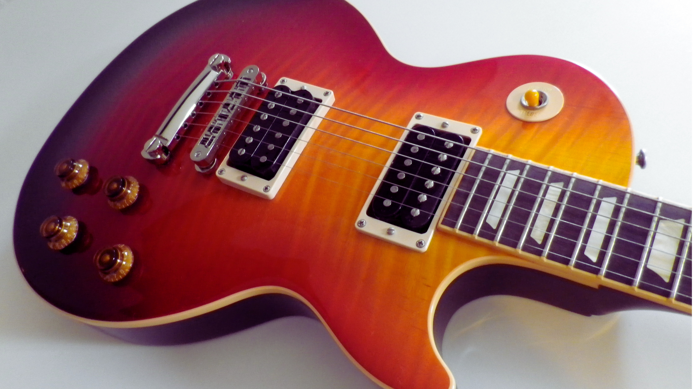{ loading=lazy width="500"}
  <figcaption>
    The lavaburst finish of the Les Paul Classic Antique week 02.
 
source: <a href="https://fr.audiofanzine.com/guitare-lp/gibson/guitar-of-the-week-2-les-paul-classic-antique-fireburst/medias/photos/" target="_blank">Audiofanzine</a>
</figcaption>
</figure>

??? example "Unique Specifications (click to expand)"

    === "BODY"
        * **Finishes**: Fireburst

    _reference: [Gibson.com](https://web.archive.org/web/20090527183227/http://www.gibson.com/en%2Dus/Divisions/Gibson%20USA/Guitar%20of%20the%20Week/Les%20Paul%20Classic%20Antique/)_

[//]: # (TODO: Add a picture of the week02)

---
### Guitar Of The Week 05 - Les Paul Classic Antique Artist Series

It is another Les Paul Classic Antique. This Guitar has a unique finish, made and signed
by Tom Morgan. The finishing is sometimes called Tom Morgan Lava. The back is painted black.

<figure markdown="span" >
  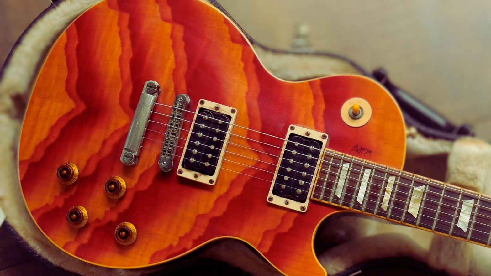{ loading=lazy width="500"}
  <figcaption>
    The unique body of the Les Paul Classic Antique week 05.
  source: <a href="https://reverb.com/ca/item/80782934-gibson-les-paul-classic-tom-morgan-electric-guitar-2007-guitar-of-the-week" target="_blank">fusionmusic</a>
</figcaption>
</figure>

??? example "Unique Specifications (click to expand)"

    === "BODY"
        * **Finishes**: Tom Morgan Art

    _reference: [Gibson.com](https://web.archive.org/web/20090527185201/http://www.gibson.com/en%2Dus/Divisions/Gibson%20USA/Guitar%20of%20the%20Week/Les%20Paul%20Classic%20Antique%205/)_

---
### Guitar Of The Week 14 - Les Paul Classic Antique - H90

For Week 14, The Les Paul Classic Antique is updated with unique H-90 pickups and an Iced Tea Sunburst finish on a
figured maple top. Gibson's H-90 stacked double coil pickup results from a close collaboration
with Billie Joe Armstrong. It offers the snarl and punch of a classic, vintage P-90 but with none of the
60-cycle hum that usually plagues traditional single-coil pickups.

<figure markdown="span" >
  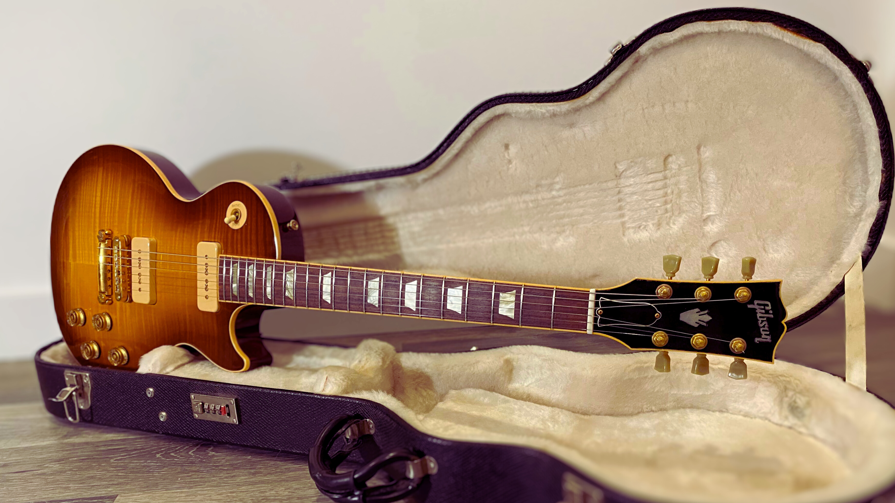{ loading=lazy width="500"}
  <figcaption>
    The week 14 and its unique H-90 pickups.
</figcaption>
</figure>

??? example "Unique Specifications (click to expand)"

    === "BODY"
        * **Finishes**: Ice Tea Burst

    === "HARDWARE"
        *  **Plating Finish**: Gold

    === "ELECTRONICS"
        * **Neck Pickup**: H-90
        * **Bridge Pickup**: H-90
        * **Controls**: 2 volume, 2 tone, 3-way switch - with push/pull pots

    _reference: [Gibson.com](https://web.archive.org/web/20090527185156/http://www.gibson.com/en%2Dus/Divisions/Gibson%20USA/Guitar%20of%20the%20Week/Les%20Paul%20Classic%20Antique%2014/)_

---
### Guitar Of The Week 19 - Les Paul Classic Antique - Zebra

The week 19 offers a unique [Zebrawood](https://www.wood-database.com/zebrawood/) top without binding.
This unique wood is known for its striking appearance and gives the guitar a rough and wild look.
Mind that the tops have different waves and lines and can differ significantly from one guitar to another.
It can be hard to evaluate the quality of the wood from a picture.
The finish is a natural satin.

The guitar is packed with two Burstbucker Pro humbuckers in neck and bridge positions.

[//]: # (TODO: review the photo of the week19)

<figure markdown="span" >
  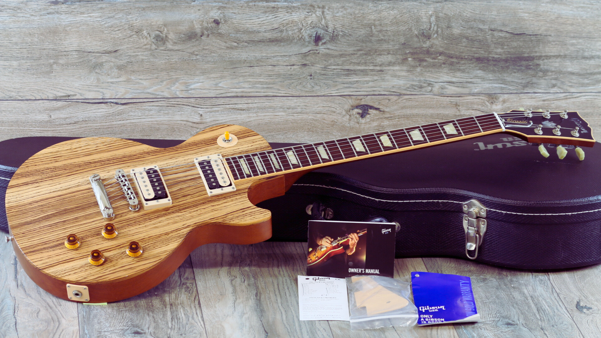{ loading=lazy width="500"}
  <figcaption>
    The unique body of the Les Paul Classic Antique week 19.
 source: <a href="https://loviesguitars.com/product/unplayed-2007-gibson-les-paul-classic-limited-edition-antique-zebrawood-ohsc/" target="_blank">Lovies Guitars</a>
</figcaption>
</figure>

??? example "Unique Specifications (click to expand)"

    === "BODY"
        * **Top Species**: Zebrawood
        * **Binding**: None
        * **Finishes**: Natural Satin

    === "ELECTRONICS"
        * **Neck Pickup**: Burstbucker Pro humbuckers
        * **Bridge Pickup**: Burstbucker Pro humbuckers

    _reference: [Gibson.com](https://web.archive.org/web/20080615020627/http://www.gibson.com/en-us/Divisions/Gibson%20USA/Guitars/Discontinuted%20Models/Guitar%20of%20the%20Week/Les%20Paul%20Classic%20Antique%20Zebra/)_

---
### Guitar Of The Week 27 - Les Paul Classic Antique - Faded Cherry

The Week 27's Les Paul Classic Antique continues Gibson's Classic line with vintage touches.
The mahogany top is finished in [Faded Cherry](img/2007-les-paul-classic-antique-week-27-body.jpeg). The pickups are '57 Classic PAF humbuckers.

<figure markdown="span">
   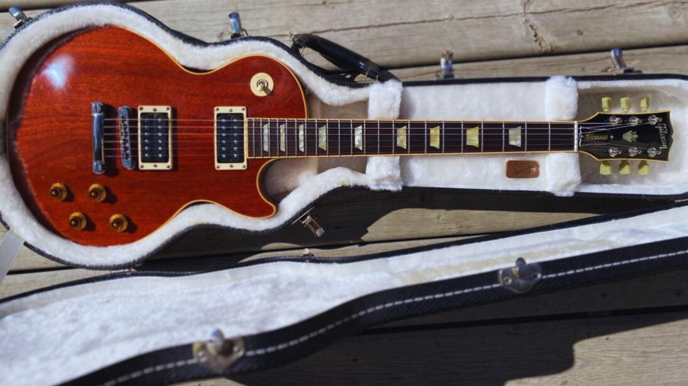{ loading=lazy width="500"}
  <figcaption>
    A Les Paul Classic Antique in Faded Cherry,  the Guitar Of The Week #27.
</figcaption>
</figure>

??? example "Unique Specifications (click to expand)"

    === "BODY"
        * **Top Species**: Mahogany
        * **Finishes**: Faded Cherry

    _reference: [Gibson.com](https://web.archive.org/web/20090527183253/http://www.gibson.com/en%2Dus/Divisions/Gibson%20USA/Guitar%20of%20the%20Week/Les%5FPaul%5FClassic%5FAntique%2DWk%5F27/)_

---
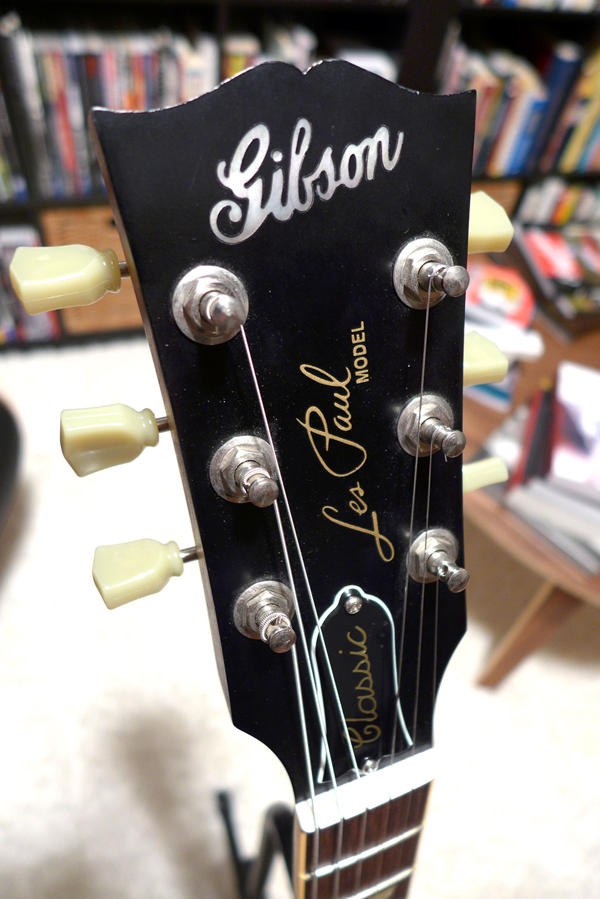{ align=right width="170" }
### Guitar Of The Week #33, Les Paul Classic Antique - Mahogany Top

It is easy to confuse the regular edition of the Antique with The Guitar of The Week #33.
They are both in a vintage sunburst with chrome hardware.
However, the distinct details make week #33 different from its sister.

The headstock of the limited edition has a pre-war Gibson logo.
The crown and the binding are not present on the headstock.
The regular Les Paul Model silk screen replaces the crown.

The finish is also something to pay attention to.
The limited edition has a smooth satin finish instead of a gloss finish. Finally, the vintage sunburst is darker in this
model.

<figure markdown="span" >
  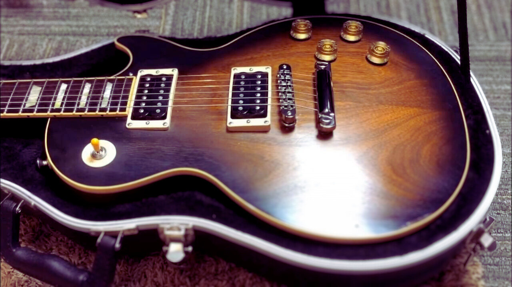{ loading=lazy width="500" }
  <figcaption>
    The satin finish of week #33 is visible on the body.  source: <a href="https://www.youtube.com/watch?v=8Q9l90UW-2U" target="_blank">Trogly's Guitar Show</a>
</figcaption>
</figure>

??? example "Unique Specifications (click to expand)"

    On top of the specification of the regular model, the week #33 has the following unique features:

    === "BODY"
        * **Top Species**: Mahogany
        * **Body Finish**: Satin Nitrocellulose Lacquer
        * **Finishes**: Satin Vintage Sunburst

    === "NECK"
        * **Head Inlay**: Americana "Gibson" Script
        * **Head Binding**: None

    _reference: [Gibson.com](https://web.archive.org/web/20090527185150/http://www.gibson.com/en%2Dus/Divisions/Gibson%20USA/Guitar%20of%20the%20Week/LP%5FClassic%5FAntique%5FM%5FWk33/)_

---
## External links

* [The "FANCY" Logo, 2007 Gibson Guitar of the Week 33 GOTW 33 Les Paul Classic Antique Review + Demo](https://www.youtube.com/watch?v=s-38AOmakes)
