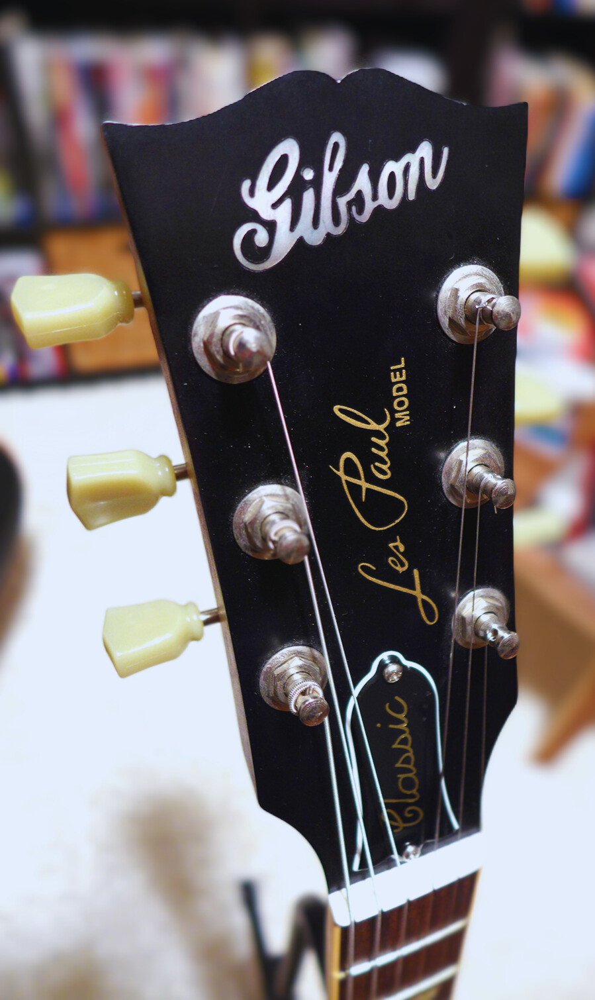

# The Gibson Les Paul Classic Antique Family
{ align=right width="240" }

In 2007, **Gibson**, along the [Les Paul Classic Custom](./2007-les-paul-classic-custom.md) did a short run of Les Paul Classic Antique models.
The Les Paul Classic Antique has a crown on the headstock
and an aged binding on the body and neck.
<!-- more -->

The standard edition of Les Paul Classic Antique was produced between 2007 and 2008.
Additionally, in 2007, the Les Paul Classic Antique was also part of
the [Guitar Of The Week](blog/category/guitar-of-the-week---gotw/) series.

All the antique comes initially with a Hardshell With Black Reptile Pattern with withe interior.

## Inventory of the Les Paul Classic Antique

{{ read_yaml('./generated_guitars_classic_antique.yml')  }}

## Details on the different models

### The standard edition

{ align=right width="240" }

The standard edition was produced between 2008 and 2007.
It is characterized by the crown and binding on the head.
The aged yellow binding, called Antique top binding, on the body, neck, and headstock is a unique family asset.
The pickups are 57's Classic to the neck and 57's Classic Plus to the bridge. They give a vintage sound that is looked
after by players.

Unlink the 1960s version; the Antique wears an AA figured maple instead of the regular plain top.
The weight of the guitar is another singular feature of the Antique.

It is expected to find them under eight pounds, making them relatively light Les Paul.
They are under three finishes: the typical honey burst, the classic heritage cherry burst and a hunter vintage burst.

### The Week #33, Les Paul Classic Antique - Mahogany Top

{ align=right width="240" }

It is easy to confuse the standard edition of the Antique with The Guitar of The Week #33.
They are both in a vintage sunburst with chrome hardware.
But very distinct details make week #33 different from its sister.

The headstock of the limited edition has a pre-war Gibson logo.
The crown and the binding are not present on the headstock.
The regular Les Paul Model silk screen replace the crown.

The finish is also something to pay attention to.
The limited edition has a smooth satin finish instead of a gloss finish. Finally, the vintage sunburst is darker in this
model.

## External links

* [The "FANCY" Logo, 2007 Gibson Guitar of the Week 33 GOTW 33 Les Paul Classic Antique Review + Demo](https://www.youtube.com/watch?v=s-38AOmakes)
