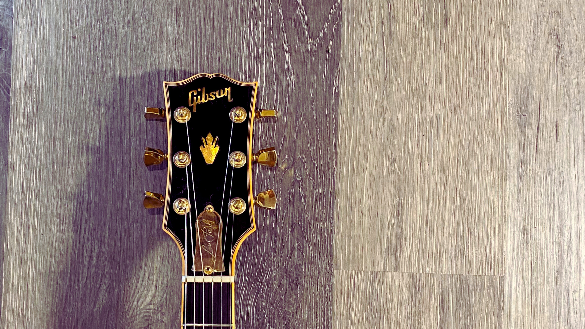
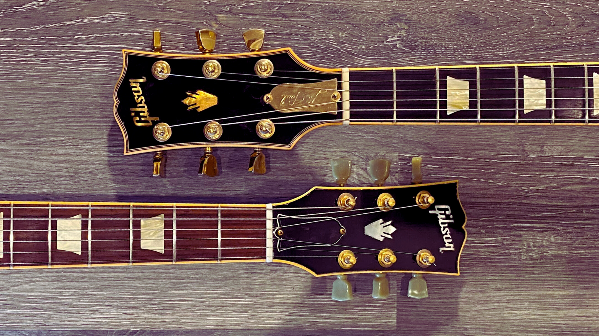
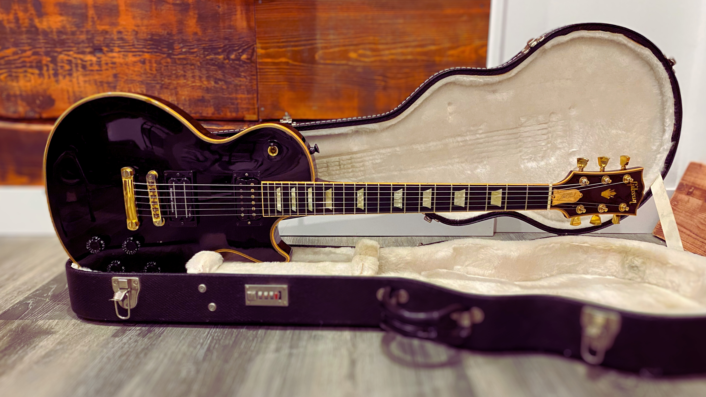
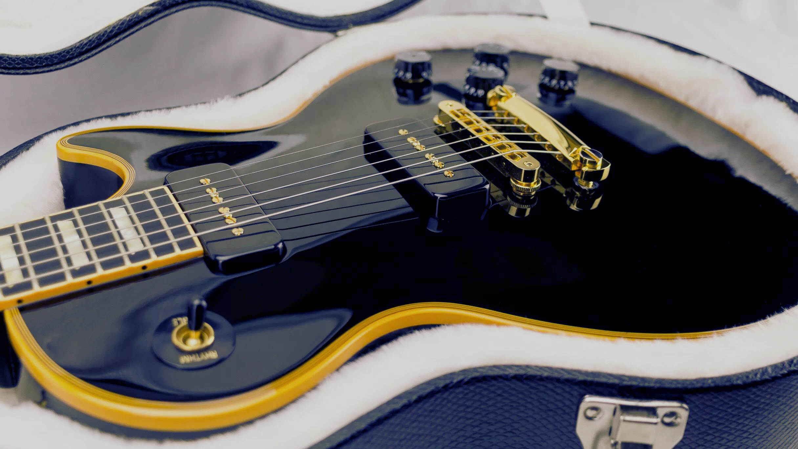
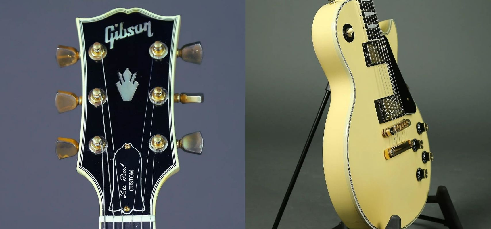

# The Classic Customs

<figure markdown="span">
    
    <figcaption>
    Head of a first edition Les Paul Classic Custom
</figcaption>
</figure>

In 2007, **Gibson**, along with the [2007-les-paul-classic-antique.md](2007-les-paul-classic-antique.md)[Les Paul Classic Antique](./2007-les-paul-classic-antique.md), released the first version of the Les Paul Classic Custom.
The guitar was a mix of the Les Paul Custom and the Les Paul Classic, with a mahogany body and neck, a maple top, and a rosewood fingerboard.
<!-- more -->

In 2007, the Les Paul Classic Custom was also part of the [Guitar Of The Week](blog/category/guitar-of-the-week---gotw/) series.
Followed by several additional runs from 2011 to 2012 and then in 2014, with different specs.
No classic custom was produced after 2014.

The Classic Custom shares the same distinct features as her sister: the [crown inlay on the headstock](2007-les-paul-classic-antique.md#a-royal-headstock) and the [aged binding](2007-les-paul-classic-antique.md#aged-bindings).

<figure markdown="span">
    { loading=lazy width="500" }
  <figcaption>
    On the top, the headtock of a Classic Custom 2007. 
    On the bottom, the headstock of a Classic Antique 2007. 
</figcaption>
</figure>

All the Classic Customs have a common attribute.
They are all close to a model the Gibson Les Paul Custom Shop produced.
Many of them mimic the fantastic Black Beauty with an ebony finish.
That's the reason why they wear multi-binding clothes.
They look to be tributes to the original Les Paul Custom Black Beauty.
The original Classic Custom from 2007 can be seen as a tribute the <a href="https://web.archive.org/web/20230727062646/https://www.gibson.com/en-US/Electric-Guitar/CUSGJ5555/Ebony-2-Pickup" target=_blank>1957's Les Paul Custom</a>.
The guitar also had a brass truss rod cover with the words `Les Paul` engraved on it.

### A tribute to the Les Paul Custom

Although Classic Custom guitars looked similar to the Les Paul Custom, some differences could be spotted by a keen eye.

For instance, the first difference was in the fretboard inlays.
While the Black Beauty had block inlays, Classic Custom had trapezoid inlays.
Moreover, the first case of the neck was not inlaid, unlike the Black Beauty.

The Classic Custom guitar had a slim taper neck, while the Black Beauty had a 50's round C.

The headstock was another point of differentiation.
It had a crown inlay, while the Les Paul Custom had a split diamond inlay.
Exception for the edition 2011-2012, which out on a split-diamond inlay.

The back of the guitar was also different.
The 7-ply binding was only on the top of the body, whereas the back was not bound.
In contrast, the Black Beauty had a 7-ply binding on both the top and the back.

<figure markdown="span">
    { loading=lazy width="600" }
  <figcaption>
    The back of a Classic Custom 2012 without the binding.  source: <a href="https://www.12fret.com/" target="_blank">The Twelfth Fret</a>
</figcaption>
</figure>

## Inventory of the Les Paul Classic Custom

The first Les Paul Classic Custom was produced in 2007 and 2008.
In 2007, during the [Guitar of the Week](2007-guitar-of-the-week.md) series,
five different versions of the Les Paul Classic Custom were produced, each with unique features.

The Les Paul Classic Custom was also produced in 2011, 2012, and 2014.

??? info "Inventory of the Les Paul Classic Custom (click to expand)"
    {{ read_yaml('./yml/generated_guitars_classic_custom.yml')  }}

## Details on the different models

---
### Les Paul Classic Custom 2007-2008

The guitar has a pair of unique gold-appointed '57 Classic humbuckers and a slim-taper neck.
This version was only available in a black ebony finish, with an aged binding and gold hardware, making it look like a Black beauty from the 50s.

The first edition, only available in a black ebony finish, was produced between 2007 and 2008, with only 150 to 200 copies,
making it one of the rarest Les Paul Classic models ever produced by Gibson.

All these assets make the Les Paul Classic Custom a desirable guitar for collectors.

<figure markdown="span">
    { loading=lazy width="600" }
  <figcaption>
    The crowned headstock of a Les Paul Classic Custom.
</figcaption>
</figure>

??? example "Specifications (click to expand)"

    === "BODY"
        * **Top Species**: Carved Maple
        * **Back Species**: Mahogany
        * **Binding**: Antique Multi-Bound Top
        * **Body Finish**: Gloss Nitrocellulose Lacquer
        * **Finishes**: Antique Ebony

    === "NECK"
        * **Species**: Mahogany
        * **Profile**: 1960s Slim Taper
        * **Head Inlay**: Antique Binding, Holly Crown
        * **Head Binding**: Antique Multi-Bound Top

    === "FINGERBOARD"
        *  **Species**: Ebony
        *  **Binding**: Antique
        *  **Inlays**: Pearloid Trapezoid

    === "HARDWARE"
        *  **Plating Finish**: Gold
        *  **Tailpiece**: Stopbar
        *  **Bridge**: Tune-O-Matic
        *  **Knobs**: Black Speed
        *  **Tuners**: Gold Grover Keystone

    === "ELECTRONICS"
        * **Neck Pickup**: '57 Classic Plus, Uncovered With Nickel Polepieces
        * **Bridge Pickup**: '57 Classic Plus, Uncovered With Nickel Polepieces
        * **Controls**: 2 Volume, 2 Tone, 3-Way Switch

    _reference: [Gibson.com](https://web.archive.org/web/20080724043107/http://www.gibson.com/en-us/Divisions/Gibson%20USA/Guitars/LesPaul/Classics/Les%20Paul%20Classic%20Custom/)_

---
### Week 16 - Les Paul Classic Custom Silverburst

[//]: # (TODO: Add description silver burst)

??? example "Unique Specifications (click to expand)"

    === "BODY"
        * **Finishes**: Custom Top Binding - White
        * **Finishes**: Silverburst

    === "NECK"
        * **Head Inlay**: White Binding, Holly Crown
        * **Head Binding**: Single bound - White

    === "FINGERBOARD"
        *  **Binding**: White

    === "HARDWARE"
        *  **Plating Finish**: Chrome

    === "ELECTRONICS"
        * **Neck Pickup**: ’57 Classic
        * **Bridge Pickup**: ’57 Classic Plus

    _reference: [Gibson.com](https://web.archive.org/web/20090527183207/http://www.gibson.com/en%2Dus/Divisions/Gibson%20USA/Guitar%20of%20the%20Week/LP%20Classic%20Custom%20Silverburst/)_

[//]: # (TODO: Add a picture of the Silverburst)

---
### Week 28 - Les Paul Classic Custom 2 P-90 Pickups

For week 28, Gibson released a special edition Les Paul Classic Custom with two P-90 pickups.
The guitar was available only in a black ebony finish, with an aged binding and gold hardware, which gave it a look similar to a [Les Paul Custom from 1954](https://www.gibson.com/en-US/Electric-Guitar/CUSZ44594/Ebony).

The main difference between week 28 and the original Classic Custom was the pickups.
Week 28 featured P-90s instead of humbuckers.

#### A tribute to the 1954's Black Beauty
The two P-90 pickups on the guitar makes it a tribute to the [1954 Black Beauty](https://www.gibson.com/en-US/Electric-Guitar/CUSZ44594/Ebony).
Note, the original Black Beauty had an alnico V "staple" pickup in the neck position and a P-90 in the bridge position.

<figure markdown="span">
    { loading=lazy width="500" }
  <figcaption>
    A close up of the pickups of the week 28.  source: <a href="https://www.guitarlovers.pt/shop/gotw/" target="_blank">Guitar Lovers</a>
  </figcaption>
</figure>

??? example "Unique Specifications (click to expand)"

    === "ELECTRONICS"
        * **Neck Pickup**: P-90
        * **Bridge Pickup**: P-90

    _reference: [Gibson.com](https://web.archive.org/web/20090527183222/http://www.gibson.com/en%252Dus/Divisions/Gibson%2520USA/Guitar%2520of%2520the%2520Week/LP%255FClassic%255FCustom%252DWeek%255F28/&sa=D&source=editors&ust=1710042194717543&usg=AOvVaw19NzdIIphRKteKKV8gWUgp)_

---
### Week 39 - Les Paul Classic Custom - creme

Unlike most of the other Classic Custom models, the week 39 edition was only available in a creme finish.
The guitar trades the aged bindings for white bindings. Gold covers hide the '57 Classic humbuckers.

<figure markdown="span">
    { loading=lazy width="500" }
  <figcaption>
    Pictures of the headstock and the creme body  of the week 39.  source: <a href="https://reverb.com/ca/p/gibson-guitar-of-the-week-number-39-les-paul-classic-custom-creme-2007?item_region=XX" target="_blank">Reverb</a>
  </figcaption>
</figure>

??? example "Unique Specifications (click to expand)"

    === "BODY"
        * **Finishes**: Creme

    === "HARDWARE"
        *  **Knobs**: Gold Speed Knobs

    === "ELECTRONICS"
        * **Neck Pickup**: Gold Covered '57 Classic Humbucker
        * **Bridge Pickup**: Gold Covered '57 Classic Humbucker

    _reference: [Gibson.com](https://web.archive.org/web/20090512171947/http://www.gibson.com/en%2Dus/Divisions/Gibson%20USA/Guitar%20of%20the%20Week/LP%2DClassic%2DCustom%2DWeek39/)_

---
### Week 42 - Les Paul Classic Custom w/3 Pickups - heritage cherry burst
[//]: # (TODO: Add description week 42)

??? example "Unique Specifications (click to expand)"

    === "BODY"
        * **Finishes**: Heritage Cherry Burst

    === "HARDWARE"
        *  **Plating Finish**: Chrome
        *  **Knobs**: Gold Speed Knobs
        *  **Tuners**: Chrome Grover Keystone

    === "ELECTRONICS"
        * **Neck Pickup**: DiMarzio Super Distortion
        * **Middle Pickup**: DiMarzio Super Distortion
        * **Bridge Pickup**: DiMarzio Super Distortion

    _reference: [Gibson.com](https://web.archive.org/web/20090527185144/http://www.gibson.com/en%2Dus/Divisions/Gibson%20USA/Guitar%20of%20the%20Week/LP%2DClassic%2DCustom%2DWeek42/)_

[//]: # (TODO: Add picture of week 42)

---
### Week 46 - Les Paul Classic Custom w/3 Pickups
[//]: # (TODO: Add description week 46)

??? example "Unique Specifications (click to expand)"

    === "ELECTRONICS"
        * **Neck Pickup**: Gold Covered '57 Classic Humbucker
        * **Middle Pickup**: Gold Covered '57 Classic Humbucker
        * **Bridge Pickup**: Gold Covered '57 Classic Humbucker

    _reference: [Gibson.com](https://web.archive.org/web/20090527185144/http://www.gibson.com/en%2Dus/Divisions/Gibson%20USA/Guitar%20of%20the%20Week/LP%2DClassic%2DCustom%2DWeek42/)_

[//]: # (TODO: Add picture of week 46)

---
### Les Paul Classic Custom 2011-2012
[//]: # (TODO: Add description classic custom 2011-2012)

??? example "Unique Specifications (click to expand)"

    === "BODY"
        * **Binding**: 7-Ply - White
        * **Finishes**: Antique Natural, Cream, Ebony, Gold Top, Wine Red

    === "NECK"
        * **Head Inlay**: Mother of Pearl "Gibson" Logo with Acrylic Split-Diamond inlay
        * **Head Binding**: 7-Ply - White

    === "FINGERBOARD"
        * **Species**: Baked Maple
        * **Binding**: White
        * **Inlays**: White Acrylic Block

    === "HARDWARE"
        *  **Tuners**: Chrome Grover Keystone

    === "ELECTRONICS"
        * **Neck Pickup**: Chrome Covered '57 Classic Humbucker
        * **Bridge Pickup**: Chrome Covered '57 Classic Humbucker

    _reference: [Gibson.com](https://web.archive.org/web/20120701073714/http://www2.gibson.com/Products/Electric-Guitars/Les-Paul/Gibson-USA/Les-Paul-Classic-Custom.aspx)_

[//]: # (TODO: Add picture classic custom 2011-2012)

---
### Les Paul Classic Custom 2014

In 2014, Gibson released a limited edition of the Classic Custom of 400 copies for <a href="https://www.guitarcenter.com/" target="_blank">Guitar Center</a>.
This limited edition had a unique headstock with a flower pot inlay. The flower pot was a tribute to the <a href="https://prewargibsonl-5.com/2022/06/10/the-story-of-the-gibson-flowerpot-by-paul-alcantara-and-darryl-wolfe/#:~:text=The%20'flowerpot'%20motif%20that%20adorns,L%2D5%20by%20several%20months." target=_blank>early Gibson models</a>.
The model featured the same specs as the 2011-2012 edition.

[//]: # (TODO: improve the picture somehow)
<figure markdown="span">
    { loading=lazy width="500" }
  <figcaption>
    Unique headstock with flower pot of the limited edition Classic Custom 2014.  source: <a href="https://www.reddit.com/r/gibson/comments/uvix81/found_this_oddball_today_at_my_local_shop_2014/" target="_blank">Reddit</a>
  </figcaption>
</figure>

??? example "Unique Specifications (click to expand)"

[//]: # (    TODO: Add specs)
[//]: # (    === "BODY")

[//]: # (        * **Binding**: 7-Ply - White)

[//]: # (        * **Finishes**: Antique Natural, Cream, Ebony, Gold Top, Wine Red)

[//]: # ()
[//]: # (    === "NECK")

[//]: # (        * **Head Inlay**: Mother of Pearl "Gibson" Logo with Acrylic Split-Diamond inlay)

[//]: # (        * **Head Binding**: 7-Ply - White)

[//]: # ()
[//]: # (    === "FINGERBOARD")

[//]: # (        * **Species**: Baked Maple)

[//]: # (        * **Binding**: White)

[//]: # (        * **Inlays**: White Acrylic Block)

[//]: # ()
[//]: # (    === "HARDWARE")

[//]: # (        *  **Tuners**: Chrome Grover Keystone)

[//]: # ()
[//]: # (    === "ELECTRONICS")

[//]: # (        * **Neck Pickup**: Chrome Covered '57 Classic Humbucker)

[//]: # (        * **Bridge Pickup**: Chrome Covered '57 Classic Humbucker)

[//]: # (    _reference: [Gibson.com]&#40;https://web.archive.org/web/20120701073714/http://www2.gibson.com/Products/Electric-Guitars/Les-Paul/Gibson-USA/Les-Paul-Classic-Custom.aspx&#41;_)

[//]: # (TODO: Add picture classic custom 2014)

---
### Les Paul Classic Custom Lite
[//]: # (TODO: Add description classic custom lite)

??? example "Unique Specifications (click to expand)"

    === "BODY"
        * **Top Species**: Grade-A Maple
        * **Binding**: 7-Ply - White
        * **Finishes**: Vintage Sunburst

    === "NECK"
        * **Head Inlay**: Acrylic "Gibson" & Holly
        * **Head Binding**: 7-Ply - White

    === "FINGERBOARD"
        * **Species**: Baked Maple
        * **Binding**: White
        * **Inlays**: Acrylic Block with 120th Banner

    === "HARDWARE"
        *  **Tuners**: Chrome Grover Keystone

    === "ELECTRONICS"
        * **Neck Pickup**: Gold Covered 490R (Alnico #2)
        * **Bridge Pickup**: Gold Covered 498T (Alnico #5)
        * **Controls**: 2 Volume, 1 Tone, 3-Way Switch, Mini-Toggle for Coil Splitting

    _reference: [Gibson.com](https://web.archive.org/web/20171014075313/http://www.gibson.com/Products/Electric-Guitars/Les-Paul/Gibson-USA/Les-Paul-Custom-Classic-Light.aspx)_

[//]: # (TODO: Add picture classic custom lite)

---
## External links

* <a href="https://www.musicradar.com/news/the-history-of-the-gibson-black-beauty" target=_blank>The history of the Gibson Black Beauty</a>
* <a href="https://www.youtube.com/watch?v=ljxC0JZbTGo&t=176s&ab_channel=TheTrogly%27sGuitarShow" target=_blank>2007 Gibson Les Paul P90 Classic Custom GOTW #28 Black Review + Demo</a>
