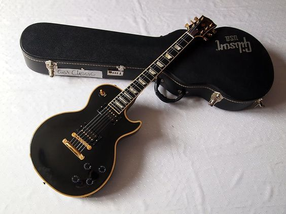

# The Classic Customs

In 2007, **Gibson**, along the [Les Paul Classic Antique](./2007-les-paul-classic-antique.md), released the fist version of the Les Paul Classic Custom.
The guitar was a mix of the Les Paul Custom and the Les Paul Classic, with a mahogany body and neck, a maple top, and a rosewood fingerboard.
<!-- more -->

Additionally, in 2007, the Les Paul Classic Antique was also part of the [Guitar Of The Week](blog/category/guitar-of-the-week---gotw/) series.
Followed, then by several additional runs in 2011 to 2012, then in 2014, with different specs.
No classic custom was produced after 2014.

The Classic Custom shares the same distinct features than her sister, the [crown inlay on the headstock](2007-les-paul-classic-antique.md#a-royal-headstock), the [aged binding](2007-les-paul-classic-antique.md#aged-bindings).

All the Classic Custom have a common attribute.
They all are close to a model produced by the Gibson Les Paul Shop.
Many of them mimics the fantastic Black Beauty, with an ebony finish.
That's a reason why they wear a multi binding.
It's a tribute to the original Black Beauty.

<figure markdown="span">
  
  <figcaption>
    The crowned headstock of a Les Paul Classic Custom.
</figcaption>
</figure>

## Inventory of the Les Paul Classic Custom

The initial Les Paul Classic Custom was produced in 2007 and 2008.
In 2007, during the [Guitar of the Week](2007-guitar-of-the-week.md) series,
five different versions of the Les Paul Classic Custom were produced, each with unique features.

The Les Paul Classic Custom was also produced in 2011 and 2012, and in 2014.

??? info "Inventory of the Les Paul Classic Custom (click to expand)"
    {{ read_yaml('./yml/generated_guitars_classic_custom.yml')  }}

## Details on the different models

---
### Les Paul Classic Custom 2007-2008

The guitar was equipped with a pair of unique gold-appointed ’57 Classic humbuckers and a slim-taper neck.
This version was only available in a black ebony finish, with a aged binding and gold hardware, making it look like a Black beauty from the 50's.

The first edition, only available in a black ebony finish, was produced between 2007 and 2008, with only 150 to 200 copies,
making it one of the rarest Les Paul Classic models ever produced by Gibson.

All these assets make the Les Paul Classic Custom a very desirable guitar for collectors.

??? example "Specifications (click to expand)"

    === "BODY"
        * **Top Species**: Carved Maple
        * **Back Species**: Mahogany
        * **Binding**: Antique Multi-Bound Top
        * **Body Finish**: Gloss Nitrocellulose Lacquer
        * **Finishes**: Antique Ebony

    === "NECK"
        * **Species**: Mahogany
        * **Profile**: 1960s Slim Taper
        * **Head Inlay**: Antique Binding, Holly Crown
        * **Head Binding**: Antique Multi-Bound Top

    === "FINGERBOARD"
        *  **Species**: Ebony
        *  **Binding**: Antique
        *  **Inlays**: Pearloid Trapezoid

    === "HARDWARE"
        *  **Plating Finish**: Gold
        *  **Tailpiece**: Stopbar
        *  **Bridge**: Tune-O-Matic
        *  **Knobs**: Black Speed
        *  **Tuners**: Gold Grover Keystone

    === "ELECTRONICS"
        * **Neck Pickup**: ’57 Classic Plus, Uncovered With Nickel Polepieces
        * **Bridge Pickup**: ’57 Classic Plus, Uncovered With Nickel Polepieces
        * **Controls**: 2 Volume, 2 Tone, 3-Way Switch

    _reference: [Gibson.com](https://web.archive.org/web/20080724043107/http://www.gibson.com/en-us/Divisions/Gibson%20USA/Guitars/LesPaul/Classics/Les%20Paul%20Classic%20Custom/)_

<figure markdown="span">
    { width="600" }
  <figcaption>
    The crowned headstock of a Les Paul Classic Custom.
</figcaption>
</figure>

---
### Week 16 - Les Paul Classic Custom Silverburst

[//]: # (TODO: Add description silverburst)

??? example "Unique Specifications (click to expand)"

    === "BODY"
        * **Finishes**: Custom Top Binding - White
        * **Finishes**: Silverburst

    === "NECK"
        * **Head Inlay**: White Binding, Holly Crown
        * **Head Binding**: Single bound - White

    === "FINGERBOARD"
        *  **Binding**: White

    === "HARDWARE"
        *  **Plating Finish**: Chrome

    === "ELECTRONICS"
        * **Neck Pickup**: ’57 Classic
        * **Bridge Pickup**: ’57 Classic Plus

    _reference: [Gibson.com](https://web.archive.org/web/20090527183207/http://www.gibson.com/en%2Dus/Divisions/Gibson%20USA/Guitar%20of%20the%20Week/LP%20Classic%20Custom%20Silverburst/)_

[//]: # (TODO: Add picture of the Silverburst)

---
### Week 28 - Les Paul Classic Custom 2 P-90 Pickups

[//]: # (TODO: Add description week 28)

??? example "Unique Specifications (click to expand)"

    === "ELECTRONICS"
        * **Neck Pickup**: P-90
        * **Bridge Pickup**: P-90

    _reference: [Gibson.com](https://web.archive.org/web/20090527183222/http://www.gibson.com/en%252Dus/Divisions/Gibson%2520USA/Guitar%2520of%2520the%2520Week/LP%255FClassic%255FCustom%252DWeek%255F28/&sa=D&source=editors&ust=1710042194717543&usg=AOvVaw19NzdIIphRKteKKV8gWUgp)_

[//]: # (TODO: Add picture of the 2 P-90 Pickups)

---
### Week 39 - Les Paul Classic Custom - creme
[//]: # (TODO: Add description week 39)

??? example "Unique Specifications (click to expand)"

    === "BODY"
        * **Finishes**: Creme

    === "HARDWARE"
        *  **Bridge**: Nashville
        *  **Knobs**: Gold Speed Knobs

    === "ELECTRONICS"
        * **Neck Pickup**: Gold Covered '57 Classic Humbucker
        * **Bridge Pickup**: Gold Covered '57 Classic Humbucker

    _reference: [Gibson.com](https://web.archive.org/web/20090512171947/http://www.gibson.com/en%2Dus/Divisions/Gibson%20USA/Guitar%20of%20the%20Week/LP%2DClassic%2DCustom%2DWeek39/)_

[//]: # (TODO: Add picture of week 39)

---
### Week 42 - Les Paul Classic Custom w/3 Pickups - heritage cherry burst
[//]: # (TODO: Add description week 42)

??? example "Unique Specifications (click to expand)"

    === "BODY"
        * **Finishes**: Heritage Cherry Burst

    === "HARDWARE"
        *  **Plating Finish**: Chrome
        *  **Bridge**: Nashville
        *  **Knobs**: Gold Speed Knobs
        *  **Tuners**: Chrome Grover Keystone

    === "ELECTRONICS"
        * **Neck Pickup**: DiMarzio Super Distortion
        * **Middle Pickup**: DiMarzio Super Distortion
        * **Bridge Pickup**: DiMarzio Super Distortion

    _reference: [Gibson.com](https://web.archive.org/web/20090527185144/http://www.gibson.com/en%2Dus/Divisions/Gibson%20USA/Guitar%20of%20the%20Week/LP%2DClassic%2DCustom%2DWeek42/)_

[//]: # (TODO: Add picture of week 42)

---
### Week 46 - Les Paul Classic Custom w/3 Pickups
[//]: # (TODO: Add description week 46)

??? example "Unique Specifications (click to expand)"

    === "HARDWARE"
        *  **Bridge**: Nashville

    === "ELECTRONICS"
        * **Neck Pickup**: Gold Covered '57 Classic Humbucker
        * **Middle Pickup**: Gold Covered '57 Classic Humbucker
        * **Bridge Pickup**: Gold Covered '57 Classic Humbucker

    _reference: [Gibson.com](https://web.archive.org/web/20090527185144/http://www.gibson.com/en%2Dus/Divisions/Gibson%20USA/Guitar%20of%20the%20Week/LP%2DClassic%2DCustom%2DWeek42/)_

[//]: # (TODO: Add picture of week 46)

---
### Les Paul Classic Custom 2011-2012
[//]: # (TODO: Add description classic custom 2011-2012)

??? example "Unique Specifications (click to expand)"

    === "BODY"
        * **Binding**: 7-Ply - White
        * **Finishes**: Antique Natural, Cream, Ebony, Gold Top, Wine Red

    === "NECK"
        * **Head Inlay**: Mother of Pearl "Gibson" Logo with Acrylic Split-Diamond inlay
        * **Head Binding**: 7-Ply - White

    === "FINGERBOARD"
        * **Species**: Baked Maple
        * **Binding**: White
        * **Inlays**: White Acrylic Block

    === "HARDWARE"
        *  **Tuners**: Chrome Grover Keystone

    === "ELECTRONICS"
        * **Neck Pickup**: Chrome Covered '57 Classic Humbucker
        * **Bridge Pickup**: Chrome Covered '57 Classic Humbucker

    _reference: [Gibson.com](https://web.archive.org/web/20120701073714/http://www2.gibson.com/Products/Electric-Guitars/Les-Paul/Gibson-USA/Les-Paul-Classic-Custom.aspx)_

[//]: # (TODO: Add picture classic custom 2011-2012)

---
### Les Paul Classic Custom 2014
[//]: # (TODO: Add description classic custom 2014)

??? example "Unique Specifications (click to expand)"

[//]: # (    TODO: Add specs)
[//]: # (    === "BODY")

[//]: # (        * **Binding**: 7-Ply - White)

[//]: # (        * **Finishes**: Antique Natural, Cream, Ebony, Gold Top, Wine Red)

[//]: # ()
[//]: # (    === "NECK")

[//]: # (        * **Head Inlay**: Mother of Pearl "Gibson" Logo with Acrylic Split-Diamond inlay)

[//]: # (        * **Head Binding**: 7-Ply - White)

[//]: # ()
[//]: # (    === "FINGERBOARD")

[//]: # (        * **Species**: Baked Maple)

[//]: # (        * **Binding**: White)

[//]: # (        * **Inlays**: White Acrylic Block)

[//]: # ()
[//]: # (    === "HARDWARE")

[//]: # (        *  **Tuners**: Chrome Grover Keystone)

[//]: # ()
[//]: # (    === "ELECTRONICS")

[//]: # (        * **Neck Pickup**: Chrome Covered '57 Classic Humbucker)

[//]: # (        * **Bridge Pickup**: Chrome Covered '57 Classic Humbucker)

[//]: # (    _reference: [Gibson.com]&#40;https://web.archive.org/web/20120701073714/http://www2.gibson.com/Products/Electric-Guitars/Les-Paul/Gibson-USA/Les-Paul-Classic-Custom.aspx&#41;_)

[//]: # (TODO: Add picture classic custom 2014)

---
### Les Paul Classic Custom Lite
[//]: # (TODO: Add description classic custom lite)

??? example "Unique Specifications (click to expand)"

    === "BODY"
        * **Top Species**: Grade-A Maple
        * **Binding**: 7-Ply - White
        * **Finishes**: Vintage Sunburst

    === "NECK"
        * **Head Inlay**: Acrylic "Gibson" & Holly
        * **Head Binding**: 7-Ply - White

    === "FINGERBOARD"
        * **Species**: Baked Maple
        * **Binding**: White
        * **Inlays**: Acrylic Block with 120th Banner

    === "HARDWARE"
        *  **Tuners**: Chrome Grover Keystone

    === "ELECTRONICS"
        * **Neck Pickup**: Gold Covered 490R (Alnico #2)
        * **Bridge Pickup**: Gold Covered 498T (Alnico #5)
        * **Controls**: 2 Volume, 1 Tone, 3-Way Switch, Mini-Toggle for Coil Splitting

    _reference: [Gibson.com](https://web.archive.org/web/20171014075313/http://www.gibson.com/Products/Electric-Guitars/Les-Paul/Gibson-USA/Les-Paul-Custom-Classic-Light.aspx)_

[//]: # (TODO: Add picture classic custom lite)
