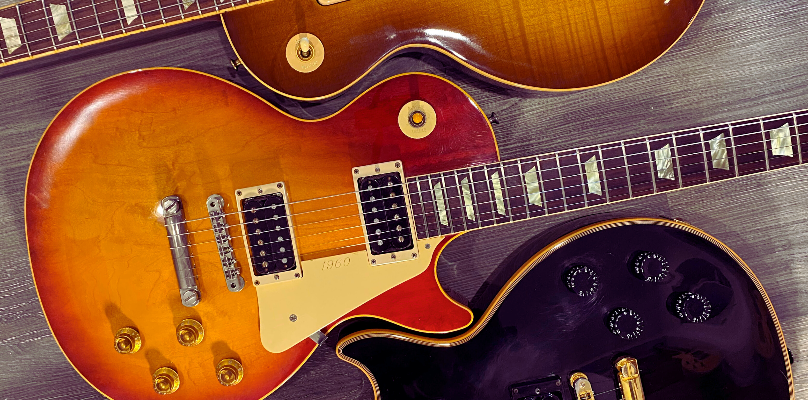

# Inventory of the Les Paul Classics

<figure markdown="span">
    
    <figcaption>
    Several different bodies of the Les Paul Classic.
</figcaption>
</figure>

Since the first year of production, in 1989, the Les Paul Classic has been a popular model.
The Les Paul Classic has been produced in different versions, and each one has its own unique features.
And we are documenting them all.
<!-- more -->

Each Les Paul Classic can be seen a tribute to a iconic Les Paul guitar.
The first Les Paul Classic, the 1960, was a tribute to the 1960 Les Paul Standard.

In 2018, a version with two P90 pickups was released.
It was produced with a gold top finish and an ebony finish, tribute to the Les Paul of 1956.

<figure markdown="span">
    { loading=lazy width="500" }
    <figcaption>
    A 2018 Les Paul Classic with P90 pickups Goldtop (left)
    and a 1956 Les Paul Goldtop (right) side by side.
</figcaption>
</figure>

The listing include the model, a picture of one of the finishes, the year the production started, and the year it ended.
The links are to the dedicated pages for each model and the Reverb page for the model.

???+ info "Inventory of the Les Paul Classic (click to expand)"
    {{ read_yaml('./yml/generated_guitars_classic.yml')  }}
