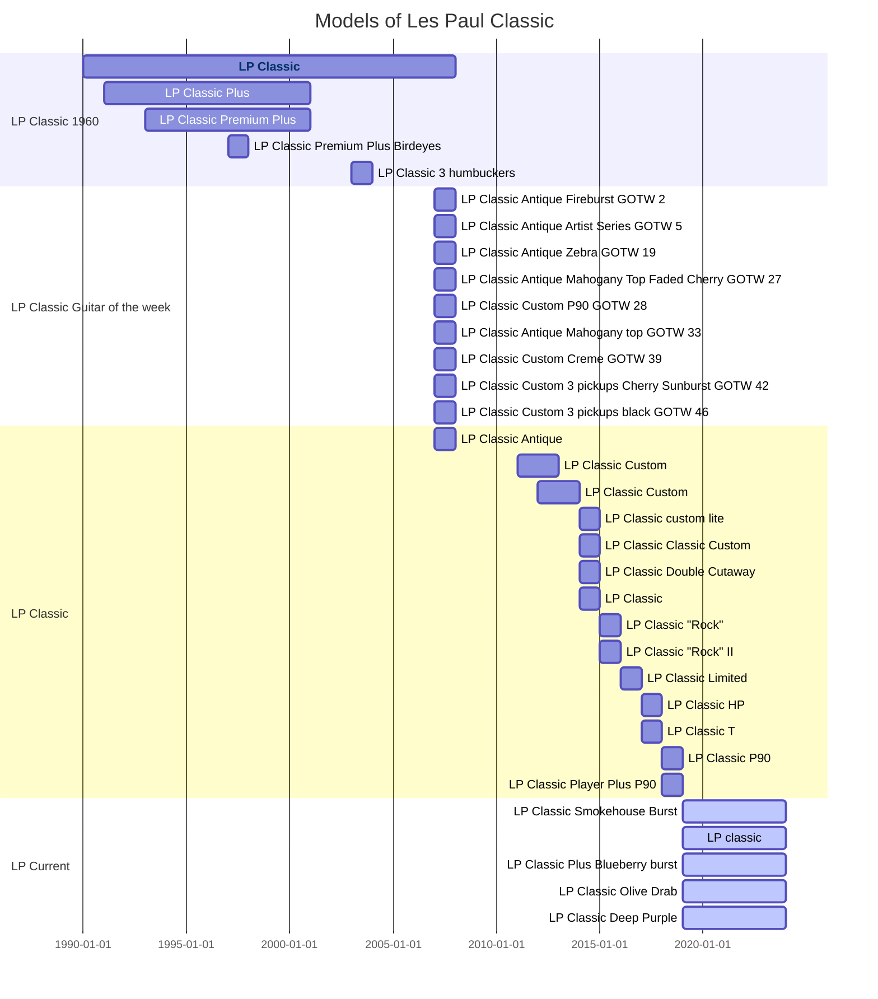

# Where Tradition Meets Innovation

Welcome to the home of the Gibson Les Paul Classic, a guitar that seamlessly blends vintage charm with modern features.
It's the perfect choice for players who cherish the classic Les Paul sound but desire contemporary playability.

## A Modern Classic Born from Vintage Roots

**Vintage Inspired, Modernly Equipped:** Originally inspired by the 1960 Les Paul Standard, the Classic model features slim neck profiles, a range of finishes, and the timeless Les Paul design.

## Evolving Sound and Style

**Dynamic Pickups for Every Style:** From ceramic magnet humbuckers to varied pickup options, the Les Paul Classic adapts to all musical genres.

**Aesthetic Variety:** Offering everything from traditional to modern finishes, there’s a Les Paul Classic to match every guitarist's style.

## Playability and Innovation

**Enhanced Features:** With advancements like coil-tapping and weight relief, the Les Paul Classic is designed for today's versatile musician.

## A Guitar for Every Era

**Timeless Appeal, Modern Appeal:** The Gibson Les Paul Classic stands as a testament to the unending allure of music, transcending genres and eras.

Discover the Gibson Les Paul Classic - a perfect harmony of history and progression.


Rediscover the past, play into the future with the Gibson Les Paul Classic.




<div class="grid cards" markdown>

- :fontawesome-brands-html5: __HTML__ for content and structure
- :fontawesome-brands-js: __JavaScript__ for interactivity
- :fontawesome-brands-css3: __CSS__ for text running out of boxes
- :fontawesome-brands-internet-explorer: __Internet Explorer__ ... huh?

</div>

<div class="grid" markdown>

=== "Unordered list"

    * Sed sagittis eleifend rutrum
    * Donec vitae suscipit est
    * Nulla tempor lobortis orci

=== "Ordered list"

    1. Sed sagittis eleifend rutrum
    2. Donec vitae suscipit est
    3. Nulla tempor lobortis orci

``` title="Content tabs"
=== "Unordered list"

    * Sed sagittis eleifend rutrum
    * Donec vitae suscipit est
    * Nulla tempor lobortis orci

=== "Ordered list"

    1. Sed sagittis eleifend rutrum
    2. Donec vitae suscipit est
    3. Nulla tempor lobortis orci
```

</div>
