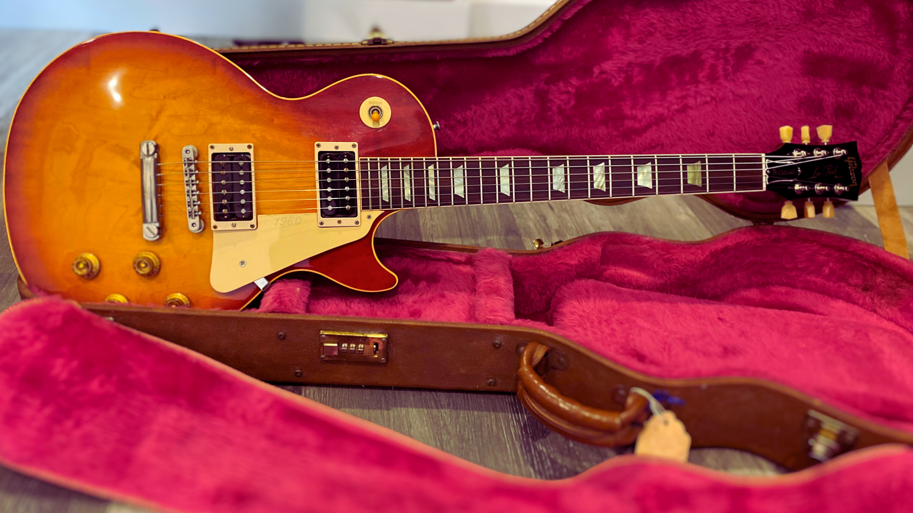

---
hide:
  - navigation
  - toc
---
# Homepage

[//]: # (![Les Paul Classic 1960 with Model]&#40;img/1996-Gibson-Les-Paul-Classic-consignment-12-scaled.jpg&#41;)

## Welcome to the Les Paul Classic Website

Welcome to this website focused on the Les Paul Classic by Gibson,
which is a contemporary take on the original Les Paul guitar from the 1960s.
For those who are lucky enough to possess a Les Paul Classic,
this website offers valuable insights and information.
If you are an admirer of Gibson Les Paul guitars,
I hope you will find the content presented here informative and engaging.

[//]: # (-   :simple-c: __Les Paul Classic 1960__)

[//]: # ()
[//]: # (    The original model)

[//]: # ()
[//]: # (    ---)

[//]: # ([//]: # &#40;    [:octicons-arrow-right-24: Articles]&#40;blog/category/classic-1960/&#41;&#41;)
[//]: # (    WIP)

[//]: # ()
-   :fontawesome-regular-rectangle-list: __Inventory__

    All the Les Paul Classic produced since 1989.

    ---
    [:octicons-arrow-right-24: Article](blog/posts/inventory-les-paul-classics.md)

-   :material-crown-outline: __Les Paul Classic Antique__

    Crown on the head, vintage-inspired.

    ---
    [:octicons-arrow-right-24: Article](blog/posts/2007-les-paul-classic-antique.md)

-   :material-diamond: __Les Paul Classic Custom__

    Classic with a taste of custom shop.

    ---
    [:octicons-arrow-right-24: Article](blog/posts/2007-les-paul-classic-custom.md)

-   :material-calendar-week: __Les Paul Classic Guitars of the Week__

    A unique guitar every week.

    ---

    [:octicons-arrow-right-24: Article](blog/posts/2007-guitar-of-the-week.md)

<figure markdown="span">
    { width=1000 loading=lazy }
    <figcaption>
    A Les Paul Classic 1960, the original model
</figcaption>
</figure>
