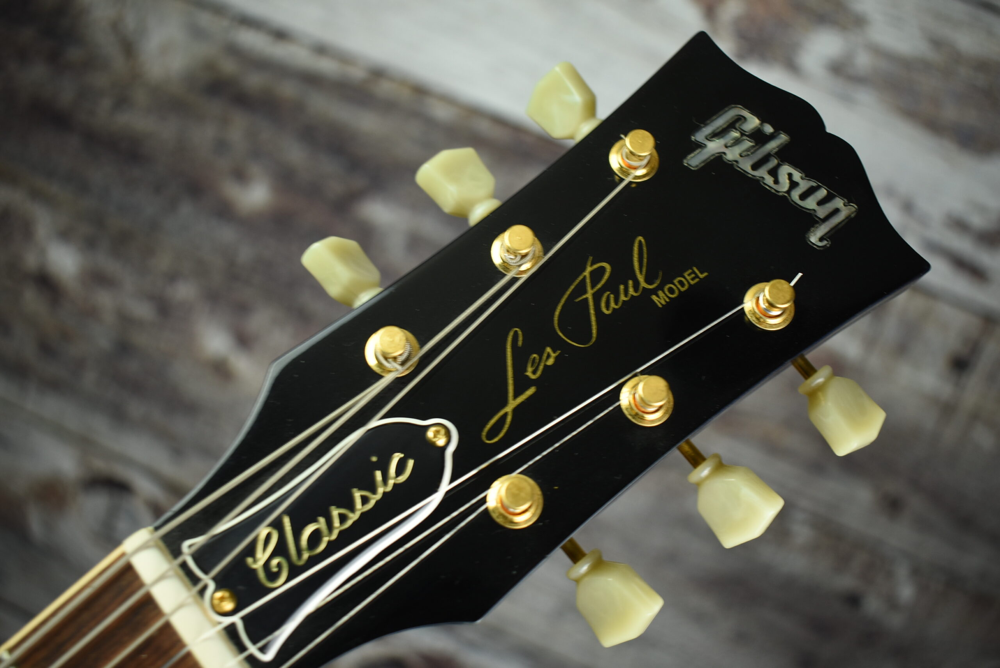

# Where Tradition Meets Innovation

-   :simple-c: __Les Paul Classic 1960__

    ---
    The original model, released in 1990.

    [:octicons-arrow-right-24: Articles](blog/category/classic-1960/)

-   :material-crown-outline: __Les Paul Classic Antique__

    ---
    Vintage-inspired.

    [:octicons-arrow-right-24: Articles](blog/category/classic-antique/)

-   :material-diamond: __Les Paul Classic Custom__

    ---
    With custom features.

    [:octicons-arrow-right-24: Articles](blog/category/classic-customs/)

-   :material-calendar-week: __Les Paul Classic Guitars of the Week__

    ---
    [:octicons-arrow-right-24: Articles](blog/category/guitar-of-the-week---gotw/)

## Inventory of the Les Paul Classics

{{ read_yaml('./inventory-classic.yaml')  }}
